# BERT-Based Hate Speech Detection & Text Filtering

<p align="left">
  
  
  
  
</p>

This repository contains an end-to-end NLP project on "Hate Speech Detection Using Sentiment Analysis." The project leverages advanced transformer models (BERT, RoBERTa, and BERTweet) to classify toxic online content and concludes with a real-time text-filtering pipeline.

## 🎯 Project Overview & Business Problem

The exponential growth of social media has been accompanied by a troubling rise in online toxicity, hate speech, and offensive language. This content not only harms users but also creates significant challenges for platform moderation.

This project aims to build an effective and automated system to promote safer, more respectful online communication. The primary goals are:
* **Analyze & Classify Tweets:** Use advanced NLP to analyze tweets and classify them as **Hate Speech**, **Offensive Language**, or **Neither**.
* **Compare Transformer Models:** Evaluate and compare the performance of three state-of-the-art transformer models (BERT, RoBERTa, and BERTweet) specifically for this task.
* **Develop a Content Filter:** Design a real-time detection pipeline that can automatically identify and filter offensive words from detected hate speech.

## 📊 Dataset

The dataset used is a popular collection of approximately 24,000 tweets, each annotated by multiple contributors. The data is classified into three categories:
* **Class 0:** Hate Speech
* **Class 1:** Offensive Language
* **Class 2:** Neither Hate Speech nor Offensive

## ⚙️ Methodology

The project was divided into three main phases: Preprocessing, Exploratory Data Analysis (EDA), and Predictive Modeling.

### 1. Preprocessing
A rigorous text preprocessing pipeline was created to clean and normalize the raw tweet data for the models. This process is essential for reducing noise and improving model accuracy.

<p align="center">
  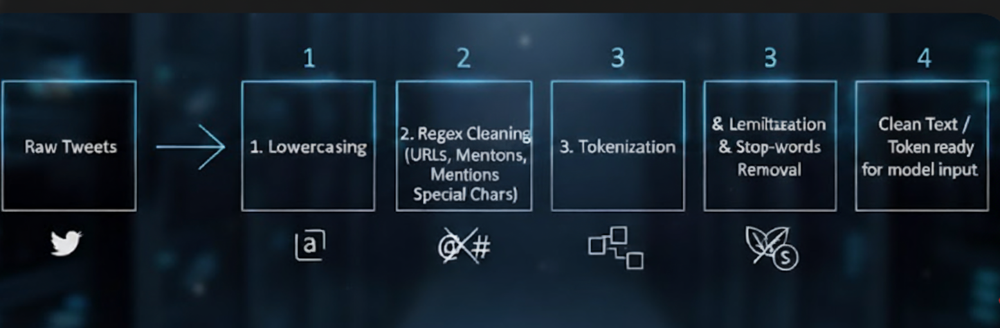
</p>

The key steps included:
* **Text Cleaning:** Converted all text to lowercase and removed URLs, user mentions (@), hashtags (#), special characters, and extra spaces.
* **Tokenization:** Split tweets into individual words (tokens).
* **Lemmatization:** Reduced words to their root form (e.g., "running" -> "run") to consolidate their meaning.
* **Stop-word Removal:** Eliminated common but non-meaningful words (e.g., "the", "a", "is") to help the model focus on important terms.

### 2. Exploratory Data Analysis (EDA)
EDA was performed to uncover insights into the dataset's composition and guide modeling strategies.

**Class Imbalance:**
The distribution of classes is highly imbalanced. The "Offensive Language" (Class 1) is the dominant class, while "Hate Speech" (Class 0) is a small minority (only ~6% of the data). This imbalance is a critical challenge, as the model could become biased towards the majority class and fail to identify the rare but important hate speech examples.

<p align="center">
  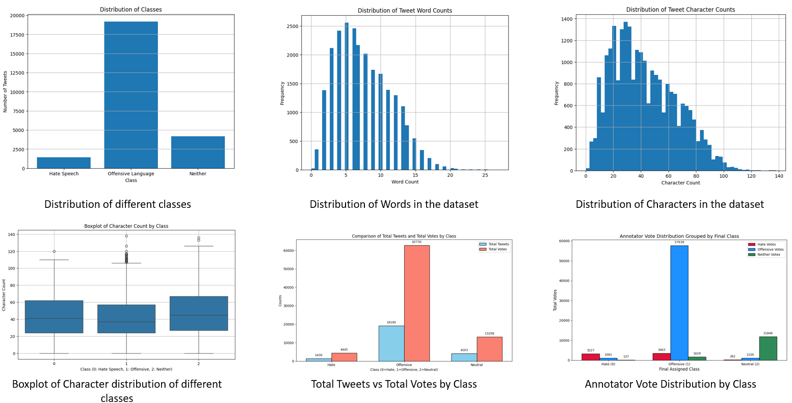
</p>

**Text Length Analysis:**
Offensive and hateful tweets tend to have different character length distributions compared to neutral tweets. The boxplot shows that neutral tweets (Class 2) have a slightly more compact length, while offensive and hateful tweets show a wider range of lengths and more outliers.

<p align="center">
  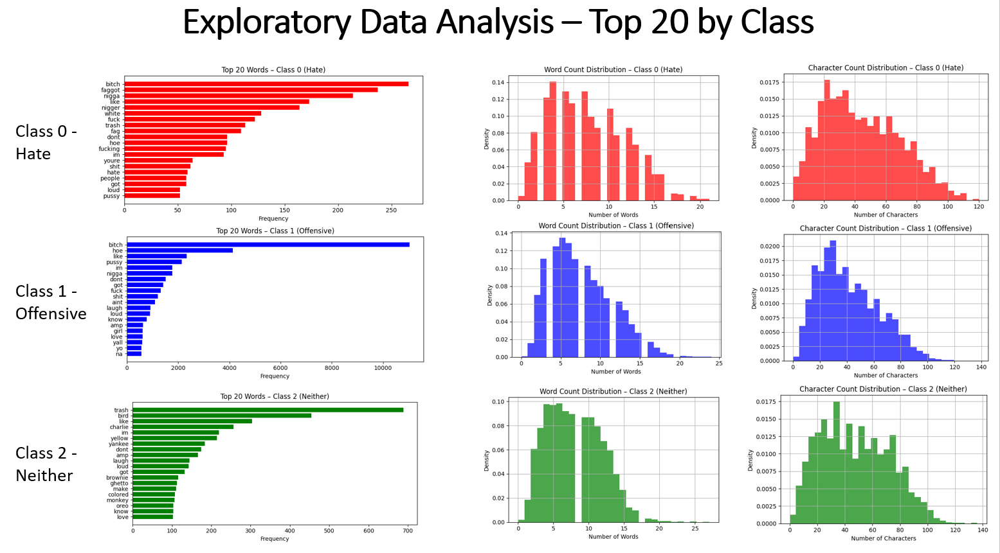
</p>

**Exploratory Data Analysis – Correlation & Density:**
Offensive and hateful tweets tend to have different character length distributions compared to neutral tweets. The boxplot shows that neutral tweets (Class 2) have a slightly more compact length, while offensive and hateful tweets show a wider range of lengths and more outliers.

<p align="center">
  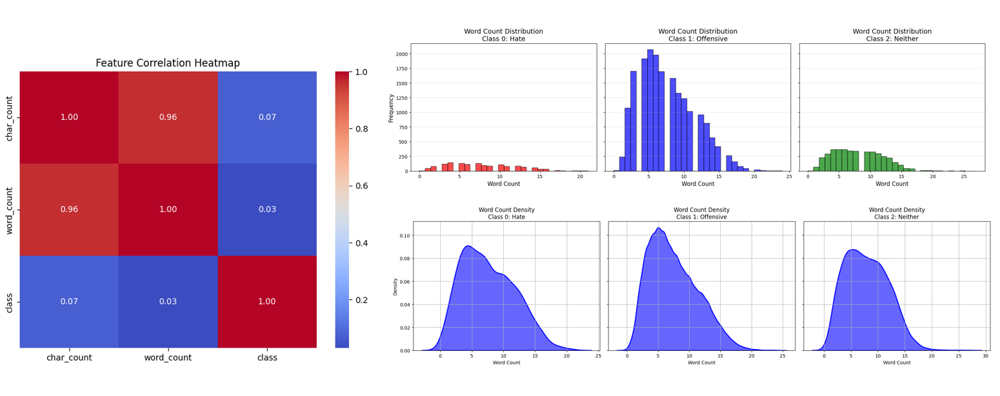
</p>

**Key Term Analysis (Word Clouds):**
Word clouds were generated to visualize the most frequent and unique words in each category. This helps to understand the distinct vocabularies used. The word "bitch" is notably prominent in "Hate Speech" and "Offensive Language," while "trash" and "pussy" are also common. The "Neither" category features more standard terms like "people" and "like."

<p align="center">
  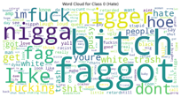
  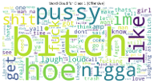
  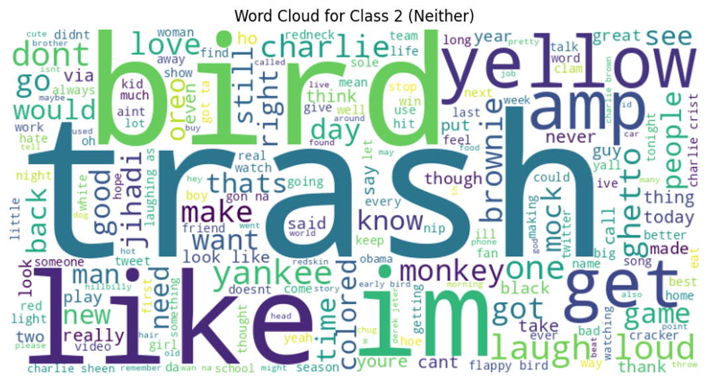
</p>

### 3. Predictive Modeling
Three powerful, pre-trained transformer models were fine-tuned and evaluated for this classification task:
* **BERT (bert-base-uncased):** The foundational transformer model, providing a strong baseline.
* **BERTweet (vinai/bertweet-base):** A model specifically pre-trained on a massive corpus of English tweets (850M tweets), making it highly effective for informal, context-heavy tweet language.
* **RoBERTa (roberta-base):** A robustly optimized version of BERT that often achieves higher accuracy.

## 📈 Results & Key Findings

All models were evaluated on their Precision, Recall, and F1-Score, with a focus on the minority "Hate Speech" (Class 0) category. The results clearly show **RoBERTa** as the superior model for this task.

<p align="center">
  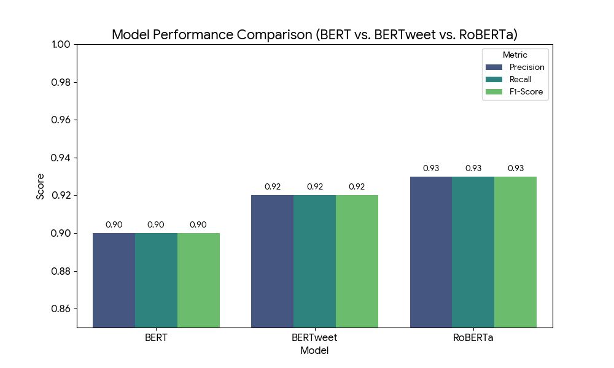
</_p>

**Key Finding:** RoBERTa achieved the best balance of Precision (93%) and Recall (93%), making it the most reliable model for accurately identifying hate speech while minimizing false positives.

### Model Performance Comparison (Confusion Matrices)
The confusion matrices visually demonstrate the performance of each model. The ideal matrix would have high numbers on the diagonal (correct predictions) and low numbers off the diagonal (errors).

<h3 align="center">BERT | BERTTweet | RoBERTa</h3>
<p align="center">
  
  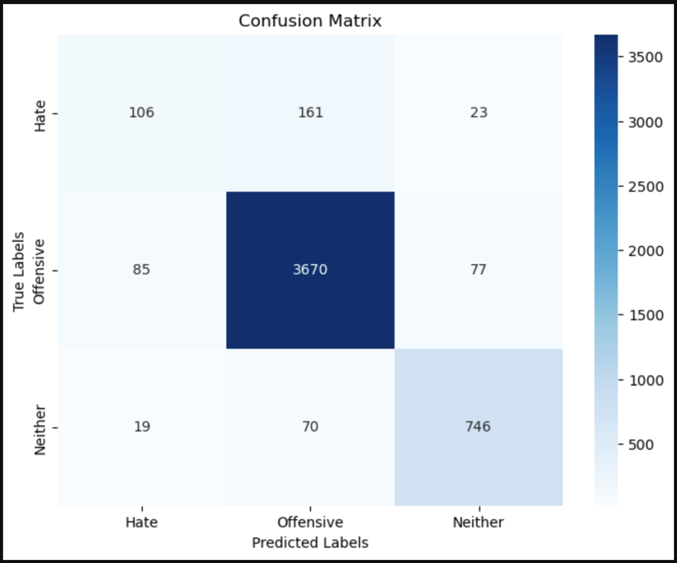
  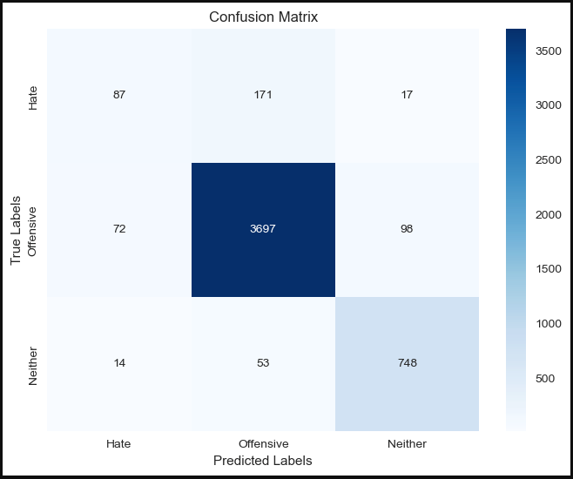
</p>

RoBERTa's matrix clearly shows the strongest performance, particularly in correctly identifying the "Hate Speech" (Class 0) and "Neither" (Class 2) categories.

## 🛡️ Hate Speech Filter (Final Pipeline)

The final deliverable is a real-time detection and filtering pipeline. Using the trained RoBERTa model, the system predicts the class of a new, unseen tweet. If classified as "Hate Speech" (Class 0) or "Offensive" (Class 1), a profanity filter is applied to censor the offending words.

Here are samples from the final output CSV, showing the filter in action:

<p align="center">
  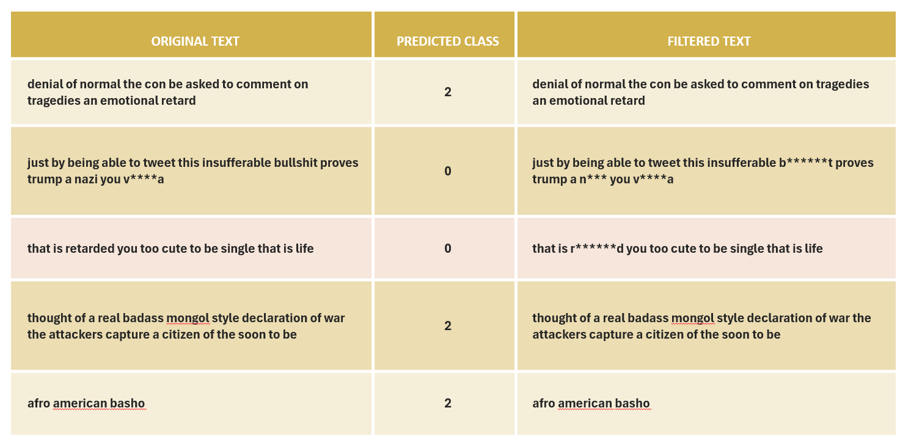
</p>

| Original Text | Predicted Class | Filtered Text |
| :--- | :--- | :--- |
| denial of normal the con be asked to comment on tragedies an emotional retard | 2 | denial of normal the con be asked to comment on tragedies an emotional retard |
| just by being able to tweet this insufferable bullshit proves trump a nazi you vagina | 0 | just by being able to tweet this insufferable b******t proves trump a n*** you v****a |
| that is retarded you too cute to be single that is life | 0 | that is r******d you too cute to be single that is life |
| straight girls go to hamburger mary once and start thinking they can say faggot | 0 | straight girls go to hamburger mary once and start thinking they can say f****t |

## 📌 Conclusion
This project successfully validated the strength of transformer models in classifying complex, informal tweet language. The **RoBERTa model** proved to be the most effective, achieving an F1-Score of 0.93 for the critical "Hate Speech" class.

The final pipeline provides a practical, AI-driven solution for social media platforms to automatically detect and moderate toxic content, helping to enforce community guidelines and create a safer online environment.

## 🛠️ Tools & Technologies Used
* **Python**
* **Hugging Face Transformers:** For BERT, RoBERTa, and BERTweet models.
* **PyTorch:** As the backend for the transformer models.
* **Pandas:** For data manipulation and loading.
* **NLTK:** For text preprocessing (tokenization, lemmatization, stop-words).
* **WordCloud:** For EDA visualizations.
* **Scikit-learn (sklearn):** For model evaluation metrics (Confusion Matrix, F1-Score).
* **Jupyter Notebook:** For interactive development and analysis.

## 🚀 How to Run This Project
This project is split into two notebooks: one for EDA and one for modeling.

1.  Clone this repository:
    ```sh
    git clone [https://github.com/YOUR_USERNAME/YOUR_REPO_NAME.git](https://github.com/YOUR_USERNAME/YOUR_REPO_NAME.git)
    ```
2.  Navigate to the project directory:
    ```sh
    cd YOUR_REPO_NAME
    ```
3.  Install the required dependencies:
    ```sh
    pip install -r requirements.txt
    ```
4.  Run the notebooks:
    * For exploratory analysis: `jupyter notebook EDA_Hate_Speech_Detection.ipynb`
    * For model training and filtering: `jupyter notebook Predictive_Modelling_BERT_Based_Hate_Speech_Detection.ipynb`
5.  **Required Files:** To run this project, you will need the original dataset (not included) and a `profanity-list.txt` file (used by the filtering script).
